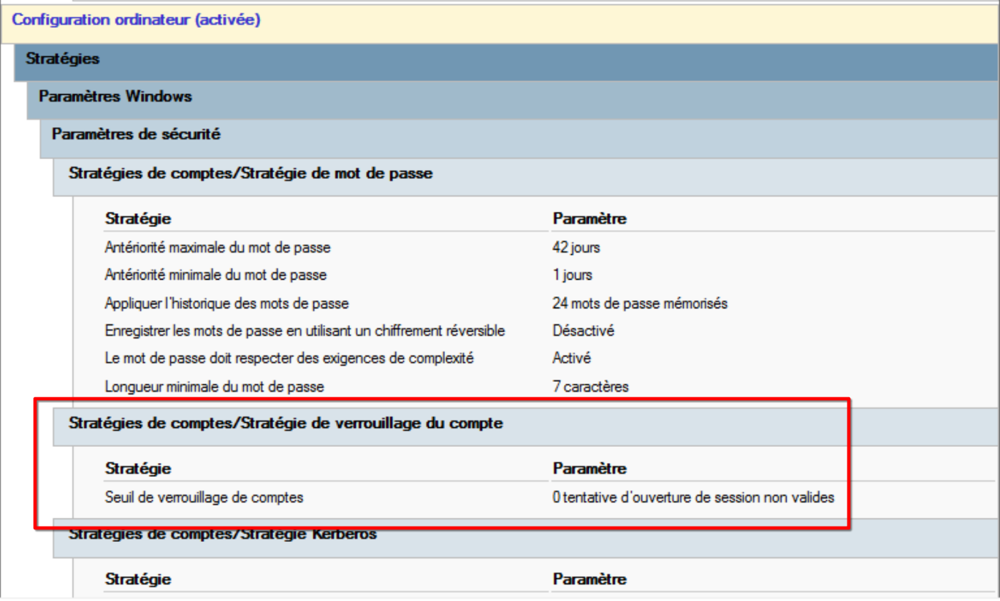

> TL;DR : Vérifier la politique de verouillage de l'AD avec `nxc smb $IP -u USR$DC_IP --pass-pol` et vérifier l'attribut `msDS-ResultantPSO` pour voir si une PSO s'applique à notre utilisateur.\
> Si la GPO spécifie un seuil de vérouillage de compte, ou si on voit qu'une PSO est appliqué on abandonne l'idée du spraying.

## Concepts

> C'est quoi le password spraying ?

C'est une attaque de brute force *optimisée*, où on inverse la logique classique :
- Bruteforce classique : Tester tous les mots de passe possibles sur un seul compte ; Pas super efficace.
- **Password spraying** : Tester quelques mots de passe (ex: moins de 100) sur un grand nombre de comptes (ex:100-1000) ; En fonction de notre wordlist on peut très bien s'en sortir avec une centaine de compte.

> À quelle étape du test d'intrusion ça intervient ?

Généralement assez tôt après la reconnaissance, car si on fait du spraying c'est qu'on n'a pas encore de pied dans le réseau.
([MITRE ATT&CK T1110.003](https://attack.mitre.org/techniques/T1110/003/))

---

## Attaque

### Reconnaissance

Avant de se lancer, il faut trois briques essentielles :
- une liste d'utilisateurs;
- une wordlist;
- la politique de verrouillage;

#### Une liste d'utilisateurs

Si on a déjà un compte fourni par le client (la majorité des cas) on peut directement lister tous les utilisateurs.
On peut l'obtenir via plusieurs protocoles (SMB, LDAP, WinRM…).
Si on doit vraiment en choisir un, LDAP et SMB restent parmi les plus utilisés (donc discret) dans le trafic interne.
```
nxc ldap $ip -u $user -p $password --users-export users.txt
```

#### Une liste de mots de passe

> Une bonne wordlist c'est pas beaucoup de mots de passe, mais très ciblés.

**Un bon spraying c'est une bonne wordlist**, et pour ça, il faut un peu d'imagination... Je vais prendre un exemple :
Lors d'un test d'intrusion sur une mairie, c'est plutôt probable qu'on ai un mot de passe du type `<nom de la ville><numéro de département>` qui traine parmis les comptes du domaine.

Donc les wordlists génériques ([rockyou](https://github.com/dw0rsec/rockyou.txt), [richelieu](https://github.com/tarraschk/richelieu), ...) vont surtout servir de *base* pour générer des listes adaptées. On ne veut pas bruteforcer les comptes !
On va générer nos propres wordlists. Pour reprendre l'exemple de la maire, on va utiliser [Geowordlist](https://github.com/p0dalirius/GeoWordlists) qui va générer des mots de passe en fonction des villes qui entourent le client.

``` bash
# Villes à 25 km autour de Paris
python3 GeoWordlists.py -p 75001 -k 25 -o ./around_paris.txt
```

> NOTE : Dès qu'on trouve un nouveau de mot de passe lors du TI, **il faut le tester sur les autres comptes**.
> Les gens, on la sale tendance à réutiliser leur mot de passe un peu partout.

#### La politique de mots de passe : Le nerf de la guerre

> C'est elle qui dicte si on peut ou non faire un password spraying !!

On veut connaître le **nombre maximum d'échecs avant le verrouillage du compte**,  si il y en a c'est dans l'un de deux endroits, les GPO et les PSO.

La politique globale est dans une GPO (Group Policy Object) `Default Domain Policy` qui définit les règles par défaut pour tout le domaine.\
N'importe quel utilisateur peut extraire cette policy :
```
nxc smb $ip -u $username -p $password --pass-pol
```

> Pour bien comprendre, GPO vs PSO l'article de hackndo sur le password spraying est vraiment bien écrit

Les PSO (Password Settings Objects) permettent d'appliquer des règles spécifiques à certains groupes (ex: admins, comptes de service).
Elles sont différentes des GPO par bien des aspects mais ce qui nous intéressent, c'est que **en tant qu'utilisateur lambda on ne peut pas voir le contenu de la GPO qui s'applique sur nous**.

```
ldeep ldap -u $username -p $password -d $domain -s "ldap://$dc" pso
```

La subtilité c'est qu'on peut même savoir si une GPO s'applique sur nous en se fiant à l'attribut LDAP `` de notre utilisateur.
En somme, **si on voit qu'une GPO s'applique on laisse tomber l'idée du spraying**, c'est trop risqué. Si le service informatique à pris le temps de faire des PSO c'est sûr à 90% qu'ils ont une politique de vérouillage de compte.

> On oublie de communiquer avec le client ! C'est pas un péché capital de lui demander si il y a des PSO dans le domaine.
> Mieux vaux ça que de lui expliquer pourquoi tout les comptes administrateurs sont bloqués (ᵔ.ᵔ)

Si on a **un utilisateur privilégié alors on peut extraitre les PSO** :

Linux
```
ldapsearch-ad.py --server $dc_ip -d $domain -u $username -p $password --type pass-pols
```

Windows
```
PS C:\Users\Administrateur> Get-ADFineGrainedPasswordPolicy -Filter *

AppliesTo                   : {CN=Victor Hugo,OU=mairie,OU=departements,DC=lyon,DC=local}
ComplexityEnabled           : True
DistinguishedName           : CN=Admins,CN=Password Settings Container,CN=System,DC=montagny,DC=local
LockoutDuration             : 00:00:00
LockoutObservationWindow    : 02:00:00
LockoutThreshold            : 3
MaxPasswordAge              : 00:00:00
MinPasswordAge              : 00:00:00
MinPasswordLength           : 16
Name                        : Admins
ObjectClass                 : msDS-PasswordSettings
ObjectGUID                  : 0ce05e56-fb60-4e8c-8258-b45035d5170b
PasswordHistoryCount        : 24
Precedence                  : 1
ReversibleEncryptionEnabled : False
```

##### Politique par défaut Active Directory

La politique par défaut, c'est celle qu'on le plus rencontrer, donc c'est important de la connaître.
Par défaut un Active Directory *crée par Windows Server 2019*, ne contient **pas de verouillage après un certain nombre d'échecs**



### Passer à l'attaque !
Une fois qu'on a tout ce qu'il faut, la phase de spraying peut commencer. Le principe reste toujours le même :
choisir un mot de passe dans la wordlist, le tester sur tous les comptes puis passer au mot de passe suivant.

```
nxc smb $dc_ip -u $userlist -p $wordlist --continue-on-success
```

---

## Défense

### Politique de mot de passe

La première ligne de défense ça reste d'avoir une bonne politique de mot de passe.
Pour ça, j'ai déjà fait [un article sur les politiques de l'ANSSI et du NIST](https://defaultmodel.eu.org/password-policy-anssi-nist), je conseille vivement de s'inspirer d'eux.

### Mitigations 

Et pour se protéger spécifiquement du password spraying le mieux c'est d'activer le verrouillage de compte après un certain nombre de tentatives.
Pour ce qui est du nombre spécifique, la il n'y a pas de bonne réponse ça dépend vraiment de l'environnement.

---

## Sources

* [Recommendations de l'ANSSI sur la politique de mots de passes](https://cyber.gouv.fr/publications/recommandations-relatives-lauthentification-multifacteur-et-aux-mots-de-passe)
* [Recommandations du CISA sur la politique de mots de passes](https://www.cisa.gov/audiences/small-and-medium-businesses/secure-your-business/require-strong-passwords)
* [Article de hackndo](https://cyber.gouv.fr/publications/recommandations-relatives-lauthentification-multifacteur-et-aux-mots-de-passe)
