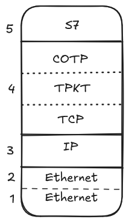
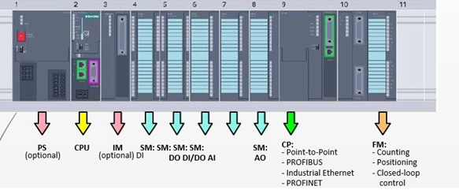

> Foreword: S7 can denote two things, the [simatic S7 PLC lineup from Siemens](https://www.siemens.com/global/en/products/automation/systems/industrial/plc.html#siem:6lqmCF6ZRpI) or the S7Comm protocol **which I will refer to as S7** throughout this post

## About the PLC

> Just in case, a PLC can be considered for our intents and purposes, the  component that will translate network packets into electrical pulses that industrial machines can understand/function on.

An S7 PLC is represented by two things apart from it's IP/port. In which **rack** and **slot** the CPU module is located

It also has an order number;\
Taken from [here](https://support.industry.siemens.com/forum/fr/en/posts/order-number-meaning/151513) (Yes you need to login but a [guerillamail](https://www.guerrillamail.com) works very well :3).

> When it comes to PLC here is a short guideline, but not bulletproof:
>
> 6ES7 = S7 \
> 6ES7**2** = 200 OR 1200 SERIES, **3** = 300 SERIES, **4** = 400 SERIES, **5** = 1500 SERIES \
> 6ES75**0** POWERSUPPLY \
> 6ES75**1**, CPU ie. 6ES7**511****-1**AK00-0AB0 = CPU 1511, you can also read number of network **-1** means one port, 6ES7**516-****3**AN01-0AB0, CPU 1516 with 3 networks \
> 6ES75**2**, DIGITAL MODULES \
> 6ES75**3**, ANALOG MODULES \
> 6ES75**4**, COMMUNICATION
> 
> For input and output: \
> 6ES752**1**, Input,  ie 6ES7**521**-1FH00-0AA0 = Digital input for 1500 series \
> 6ES752**2,** output \
> 6ES752**3,** Combination input and output

## Network

S7 works on top of two protocols TPKT and COTP, this is done due to historical reasons.
Because Siemens started to make (what is now known as) COTP so there was no IP addresses nor ports (although there was something else, see the COTP chapter) as it lived on top of Ethernet (MAC addresses only).
It worked well enough for them, but since then TCP and IP addresses have completely took over. So they made this compatibility layer with the TPKT and COTP protocol to make it work with today's TCP centric internet.
TLDR: We are stuck with the S7 protocol living on top ISO-on-TCP (composed of TPKT and COTP)

Following the **TCP-IP** model (because fuck OSI layer 5 and 6 specifically !!) this is where ISO-on-TCP and S7 lay



### TPKT

Defined via the [RFC1006](https://datatracker.ietf.org/doc/html/rfc1006).
The original ISO 8073 TP0 based protocol sent only delimited packet with a known length. 
So they needed to replicate this behaviour within the continiuous stream of TCP packets.
TPTK is here to implement just that.

#### Packet layout

ASCII layout from the RFC1006, because I think it's pretty classy !
```
 0                   1                   2                   3   
 0 1 2 3 4 5 6 7 8 9 0 1 2 3 4 5 6 7 8 9 0 1 2 3 4 5 6 7 8 9 0 1 
+-+-+-+-+-+-+-+-+-+-+-+-+-+-+-+-+-+-+-+-+-+-+-+-+-+-+-+-+-+-+-+-+
|    version    |    reserved   |          packet length        |
+-+-+-+-+-+-+-+-+-+-+-+-+-+-+-+-+-+-+-+-+-+-+-+-+-+-+-+-+-+-+-+-+
```

Attributes:
- version: (8 bits) is always 3
- reserved: (8 bits) you can put anything in there
- packet length: (16 bits) length of the packet **including the TPKT packet** so `packet_length = tpkt_length + payload_length`

<details>
	<summary><b>Scapy implementation</b></summary>
	```py
import struct
from scapy.all import bind_layers, ByteField, ShortField, Packet
from scapy.layers.inet import TCP

# Uncomment if you want COTP to be detected
# from protocols.cotp import (
#     COTP_ConnectionRequest,
#     COTP_ConnectionConfirmation,
#     COTP_Data,
# )

class TPKT(Packet):
    name = "TPKT"
    fields_desc = [
        ByteField("version", 3),
        ByteField("reserved", 0),
        ShortField("length", None),
    ]

    def post_build(self, pkt, pay):
        # Calculate the length of the payload
        if self.length is None and pay is not None:
            # Length field equates to length of TPTK packet + length of Payload
            length = len(pkt) + len(pay)
            # Set the length field in the packet
            pkt = pkt[:2] + struct.pack("!H", length) + pkt[4:]
        return pkt + pay

	# Uncomment if you want COTP to be detected
    # def guess_payload_class(self, payload):
    #     if payload[1] == "\xe0":
    #         return COTP_ConnectionRequest
    #     elif payload[1] == "\xd0":
    #         return COTP_ConnectionConfirmation
    #     elif payload[1] == "\xf0":
    #         return COTP_Data


bind_layers(TCP, TPKT, dport=102)
bind_layers(TCP, TPKT, sport=102)
	```
</details>

### COTP

> Remainder: In contrast to TCP which is stream-based, COTP is packet-based.

#### TSAP

As the original protocol didn't use IP addresses nor ports they had something else, Transport Service Access Point or TSAP.
Like ports there is a source TSAP and a destination TSAP. And much like ports the source TSAP can be a bit random but the destination TSAP must be the right one to address the right equipement.
They are binary-blob, thus they can represent anything you want. 

If we take the example of the S7 protocol they represent the **rack** and the **slot** where the CPU module of the PLC is located.
With the following structure:
- First group (8 bits), device type:
	- 01: PG or PC
	- 02: OS (operating or monitoring device)
	- 03: Others, such as OPC server, **Simatic S7 PLC**...
- Second group (8 bits), rack and slot
	- From bits 7 to 4: Rack number **multiplied by 2**
	- From bits 3 to 0: CPU slot

For example in this image of a S7-1200, the CPU module is on rack 0 in the slot 1 (we start at 0 when using the protocol):




So we would have a TSAP of 03 01:
- 03 for the PLC type 
- 01 because of rack 0*2 (0000xxxx) and slot 1 (xxxx0001)

#### Packet layout


### S7

- **Rack and Slot**: In an S7 network, each PLC is identified not only by its IP address but also by its rack and slot numbers. The rack is the physical or logical rack where the PLC is mounted, and the slot is the specific location within that rack where the CPU module resides.

- **Ports**: S7 communication typically uses port 102 for ISO-TSAP (Transport Service Access Point) communication. This port is crucial for establishing connections and transferring data between PLCs and other network devices.

- **Connections**: S7 communication can establish connections for reading and writing data. These connections are essential for programming, monitoring, and controlling the PLC.

## Memory of an S7 capable-PLC

Area or Block ?

An area is related to the memory as we came to think of it naturally and blocks are related to the program inside the PLC.

### Areas

- SZL: Read-only area that contains status about the PLC (for diagnostics)
- DB: **D**ata **B**locks are memory areas that must be declared to exist, like DB0 or DB1
- MK: Flags/Markers (**M**er**k**er in german) 1 bit variables
- AB: Outputs (also named PA) An area in which the physical I/O is copied automatically by the Bus Processor.
- EB: Inputs (also named PE) An area in which the physical I/O is copied automatically by the Bus Processor.
- TM: Timers are pretty self explanatory
- CT: Counters

### Blocks

> The (S) denotes another are or block that is handled by the system for example FC and SFC

- Organization Blocks (OB): Define the structure of the program. Some OBs run at startup. Some run continuously when the CPU is running your process. Some run under specific conditions.
- Function Blocks (FB): These are reusable blocks that can be instantiated multiple times. They have their own data storage and can maintain state information.
- Function (FC): These are stateless and do not retain data between calls. They are used for calculations or logic that does not require memory retention.
- Data Blocks (DB): These are used to store data that can be accessed globally within the program.
- System Function Blocks (SFB): Function blocks handled by the system,  they usually have an associated (S)DB
- System Functions (SFC): Function code handled by the system, th
- System Data Blocks (SDB): 

# Ressources
[Official documentation of the S7-300](https://cache.industry.siemens.com/dl/files/574/1214574/att_44504/v1/SFC_e.pdf) A bit dated but still useful, it's not like things most fast around here \<( ´＿` )\> \
[Snap7 Documentation](https://snap7.sourceforge.net/) The most prominent S7 library, thanks to _Davide Nardella_ ! \
[A few links from Orange-Cybersécurité](https://github.com/Orange-Cyberdefense/awesome-industrial-protocols/blob/main/protocols/s7comm.md) \
[GyM's S7 article](http://gmiru.com/article/s7comm/) The original inspiration for this blog post ! \
[ipesoft](https://doc.ipesoft.com/display/D2DOCV23EN/Siemens+SIMATIC+S7+ISO+on+TCP) \
[Official documentation about S7 in the S7-1200 and S7-1500 in german](https://cache.industry.siemens.com/dl/files/115/82212115/att_1034308/v3/82212115_S7_communication_S7-1500_S7-1200_de.pdf). Yep google trad and ctrl+f are your friends here \
