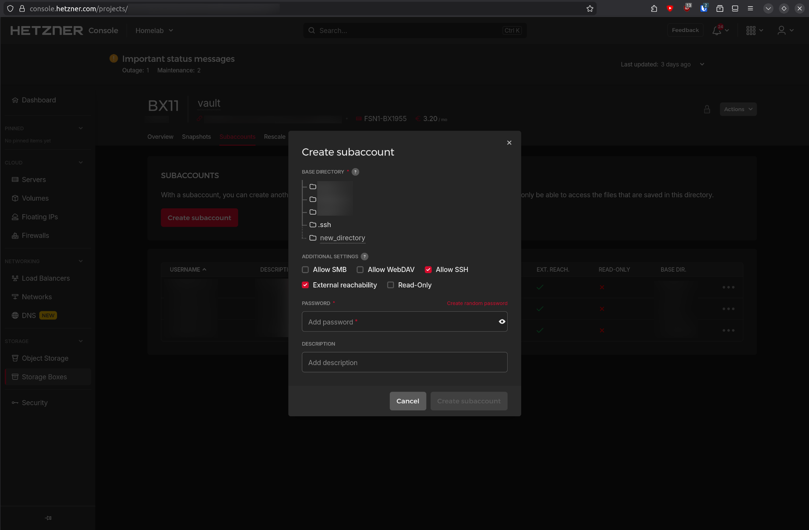
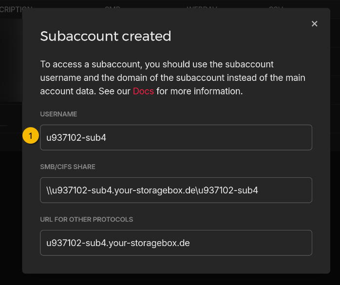
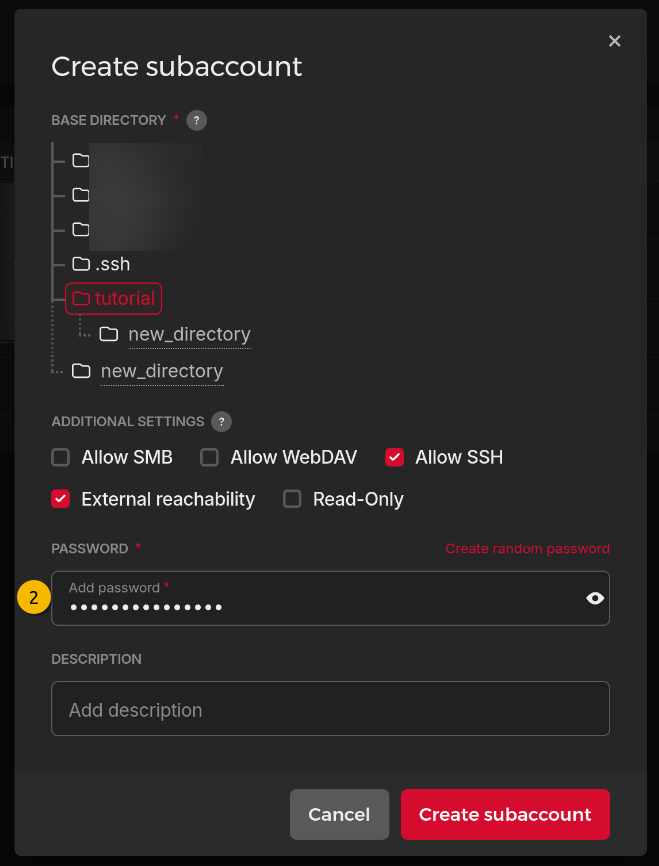
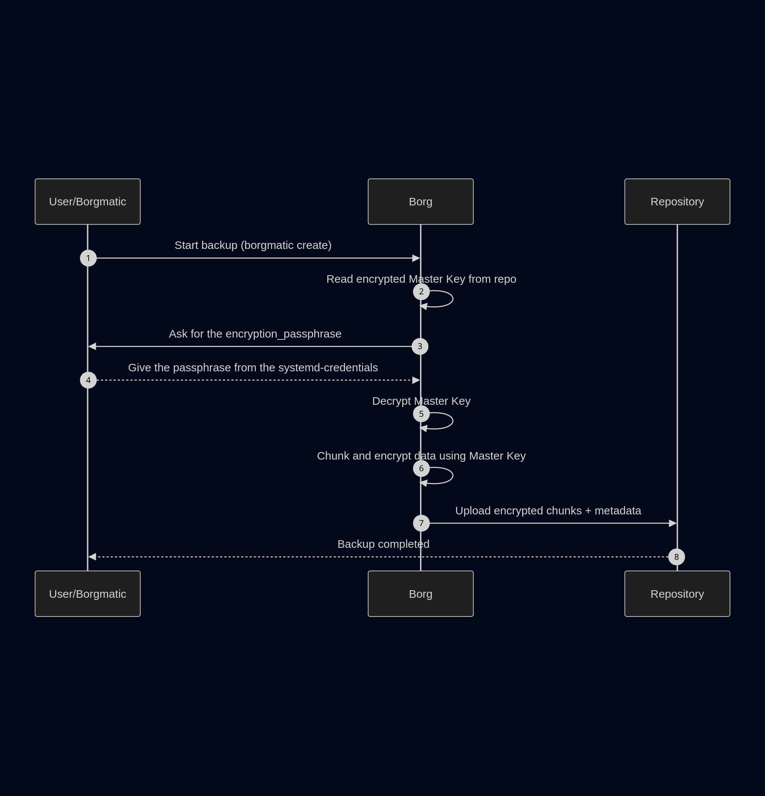
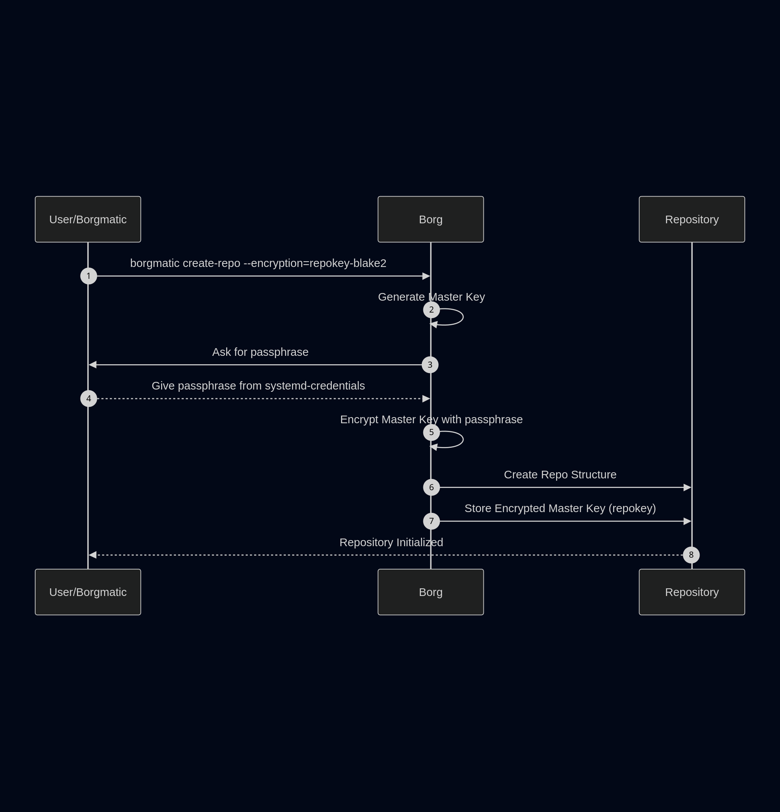
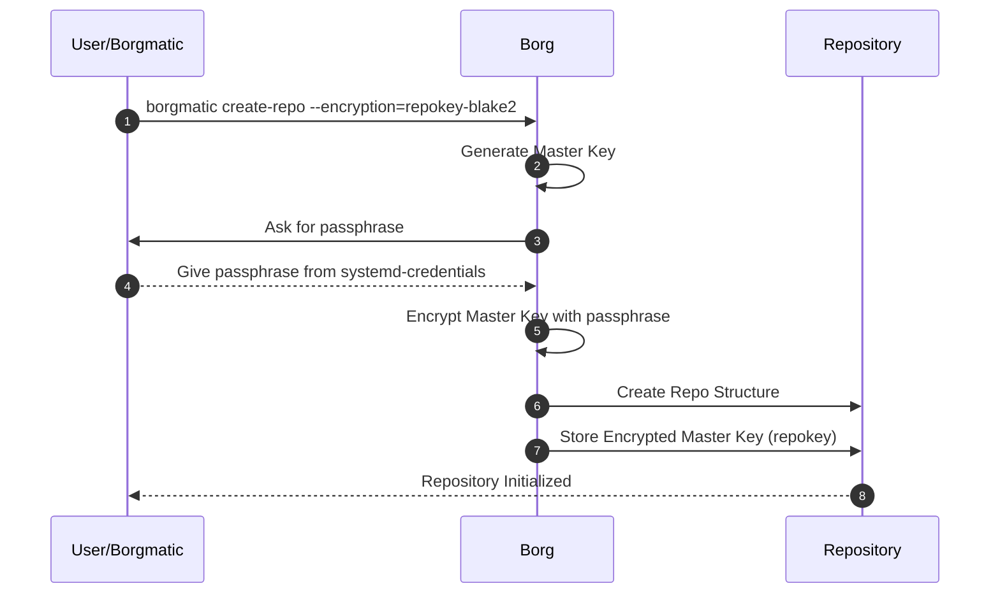
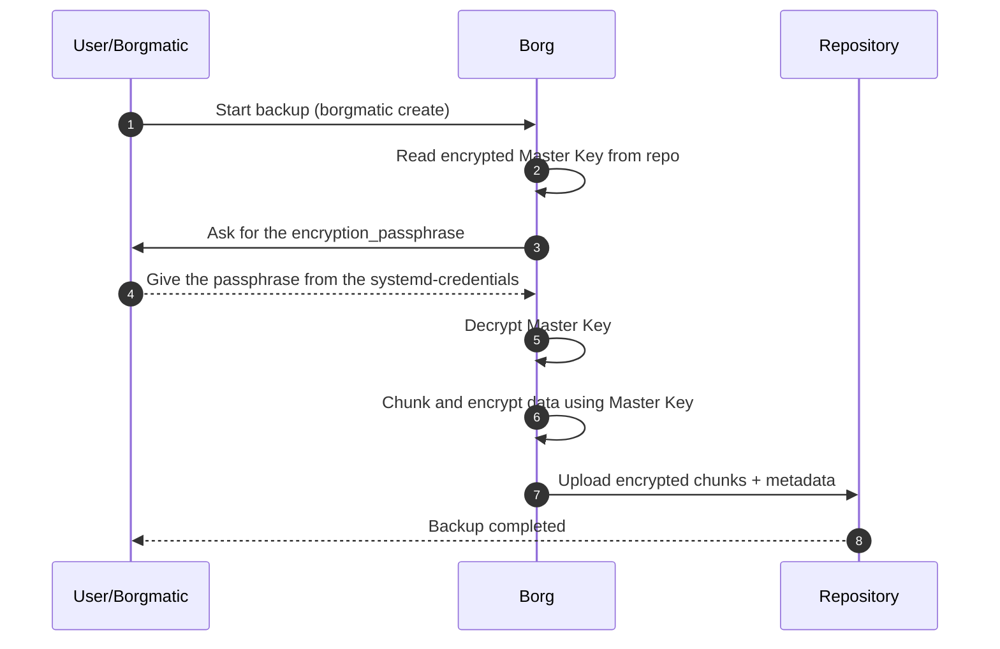

> This is an how-to that helps me setup a new VPS with my backup instance\
> *This is not the right way...* **This is my way of doing things** 

## Preparing the Hetzner part

### Creating a sub-account

This helps avoid interfering with other backups, like overwriting them by accident... like that would happen (ᵔ.ᵔ)
And it's good practice to follow the *separation of privileges* principle.

We make the sub-account accessible from outside the Hetzner network (if need be, this can be disabled when backing up through an Hetzner VPS)
and we make it accessible via SSH. In my opinion this is both the safest and easiest for a critical task like backups.

I also create a new base folder for each specific subaccount, otherwise the "non-tampering of other repositories" idea is void.



> **Information to keep** :
> 1. \+ The user of the sub-account 
> 2. \+ The password you put to create the subaccount 


### Creating the repository folder

Now we need our VPS to be recognized by the Hetzner storage box, for this we follow the [official documentation](https://docs.hetzner.com/storage/storage-box/backup-space-ssh-keys/) :

```bash
ssh-keygen # **No passphrase**, makes the configuration a lot easier
cat ~/.ssh/id_ed25519.pub | ssh -p23 "$SUBACCOUNT_USER@$SUBACCOUNT_USER.your-storagebox.de" install-ssh-key
```

Hetzner maps the folder we specified in the last figure as `/home`.
But I always create another folder structure, to keep things tidy (this does not server any purpose apart from looking nicer)

```bash
ssh -p23 "$SUBACCOUNT_USER@$SUBACCOUNT_USER.your-storagebox.de" mkdir -p "/home/$HOSTNAME/backups"
```

## Install borgmatic

As with any good tutorial, update your system first :
```bash
apt install borgbackup
```

To install borgmatic, first [install Borg](https://borgbackup.readthedocs.io/en/stable/installation.html), at least version 1.1.
Borgmatic does not install Borg automatically so as to avoid conflicts with existing Borg installations.
```bash
apt install borgbackup
```

Let's install borgmatic via the [recommended way](https://torsion.org/borgmatic/how-to/set-up-backups/#root-install), using [pipx](https://pipx.pypa.io/latest/installation/). This will give us the latest version of borgmatic (way easier to follow the documentation) :

```bash
apt install pipx
```
Then we can install borgmatic as root : 

> I know, I know... *root service = evil* but I consider that we need to make it work first, then rework security into our workflow, so we'll see about that later in the article.

This will add `/root/.local/bin` to the PATH in your `.bashrc` and reload the terminal to accept changes.
```bash
pipx ensurepath && source ~/.bashrc
```
Now we can finaly install borgmatic
```bash
pipx install borgmatic
```

## Configuring borgmatic

Borgmatic work via a configuration file, we can use this utility to generate a default configuration file that we can start from :

```bash
borgmatic config generate # Generating a configuration file at: /etc/borgmatic/config.yaml
```

This is my "sane default" configuration I put in my `/etc/borgmatic/config.yaml` :
> **Replace the following**
> - \<hostname\> with hostname of the machine (`echo $HOSTNAME`)
> - \<subaccount\> with username of new sub-account

```yaml
source_directories:
    - /home
    - /etc
    - /var/log/
    - /root
repositories:
    - path: ssh://<subaccount>@<subaccount>.your-storagebox.de:23/home/<hostname>/backups
      label: hetzner-storage-box
      encryption: repokey-blake2

encryption_passphrase: "{credential systemd borgmatic.pw}"

compression: zstd,3

keep_daily: 7
keep_weekly: 4
keep_monthly: 6
keep_yearly: 1

verbosity: 0
syslog_verbosity: 1
log_file_verbosity: 2
log_file: /var/log/borgmatic/logfile

progress: true
```

### Create the passphrase secret
You may have noted that in the configuration file we specify the encryption passphrase like so `encryption_passphrase: "{credential systemd borgmatic.pw}"`

> WARNING : This does prevent the passphrase from leaking as it is encrypted,
> **BUT** if a hacker compromises the `root` account they can already use regular borgmatic commands on the repository,
> so this does not prevent any foulplay !

```
systemd-ask-password -n | systemd-creds encrypt - /etc/credstore.encrypted/borgmatic.pw
```

> **Information to keep** :
> 1. The user of the sub-account 
> 2. The password you put for the create subaccount
> 3. \+ The repository encryption passphrase

### Handling logs
> If you want no logs (apart from journalctl) you can ignore this part and remove `log_file: /var/log/borgmatic/logfile` in the configuration file 

To prevent the logs from growing to big we need rotate them, meaning we keep only the recent logs, compress the old ones and remove the very old ones.

Logrotate is pretty the standard for such a use case :
```bash
apt install logrotate
```

Borgmatic does not create folders by default, so we need to do it ourselves. Rur logfile should be be located at `/var/log/borgmatic/logfile` so we can create the following folders :
```bash
mkdir -p /var/log/borgmatic
```

To configure logrotate and tell him to handle our borgmatic logfile we can add this to  `/etc/logrotate.d/borgmatic` :
```
/var/log/bormatic/logfile {
	weekly
	rotate 12
  notifempty
	compress
  endscript
}
```

## Creating the repository
With all the work we did, we can *finally* create the repository :
```
borgmatic repo-create --encryption repokey-blake2
```
> IMPORTANT : Export the repokey with `borgmatic key export` and **save it elsewhere than inside the VPS you are backuping**

> **Information to keep** :
> 1. The user of the sub-account 
> 2. The password you put for the create subaccount
> 3. The repository encryption passphrase
> 4. \+ The repository decryption key

We can test that our setup by making our first backup manually :
```
borgmatic create
```

## Automating the backups
Borgmatic is configured, but not automated yet. Borgmatic can be automatically started via a systemd service.
And they already provides the necessary files to do so, we can download them and put them in `/etc/systemd/system` so that systemd can find them.
```
curl https://projects.torsion.org/borgmatic-collective/borgmatic/raw/branch/main/sample/systemd/borgmatic.service | sudo tee /etc/systemd/system/borgmatic.service
curl https://projects.torsion.org/borgmatic-collective/borgmatic/raw/branch/main/sample/systemd/borgmatic.timer | sudo tee /etc/systemd/system/borgmatic.timer
```

We just need to enable the timer :
```
sudo systemctl daemon-reload
sudo systemctl enable --now borgmatic.timer
```

> By default a backup will be made every day at midnight, with a random delay up to 10 minutes added on top\
> And if the system was off at the scheduled time, it runs immediately on the next boot

## How does the repository work

When the repository is created (`borgmatic repo-create --encryption repokey-blake2`) an decryption key is created, let's call it "*Master Key*".
This *Master Key* is then encrypted with our [`encryption_passphrase`](<index#Create the passphrase secret>), so that if anyone as access to our repository, they won't be able to decrypt the actual content.

So, on each backup we make the process is as follows :



# Last words

> As with any article of mine if you see any errors or simply want to talk you are welcome to contact me at at defaultmodel[а𝗍]pm[ԁо𝗍]me

# Annex

Diagrams source code :
```mermaid
---
title: 'How I automate Backups via borgmatic to a Hetzner Repository'
seoTitle: 'fedora-borgmatic-hetzner-backups'
description: "Les différences et agréments entre l'ANSSI, le NIST et le CISA sur les façon de gérer les mots de passes"
tags: ["Backups", "Borgmatic", "Hetzner"]
pubDate: '12/6/2025'
# updateDate: '11/26/2025'
#coverImage: './password-policy-support.jpg'
---

> This is an how-to that helps me setup a new VPS with my backup instance\
> *This is not the right way...* **This is my way of doing things** 

## Preparing the Hetzner part

### Creating a sub-account

This helps avoid interfering with other backups, like overwriting them by accident... like that would happen (ᵔ.ᵔ)
And it's good practice to follow the *separation of privileges* principle.

We make the sub-account accessible from outside the Hetzner network (if need be, this can be disabled when backing up through an Hetzner VPS)
and we make it accessible via SSH. In my opinion this is both the safest and easiest for a critical task like backups.

I also create a new base folder for each specific subaccount, otherwise the "non-tampering of other repositories" idea is void.


> **Information to keep** :
> 1. \+ The user of the sub-account 
> 2. \+ The password you put to create the subaccount 


### Creating the repository folder

Now we need our VPS to be recognized by the Hetzner storage box, for this we follow the [official documentation](https://docs.hetzner.com/storage/storage-box/backup-space-ssh-keys/) :

```bash
ssh-keygen # **No passphrase**, makes the configuration a lot easier
cat ~/.ssh/id_ed25519.pub | ssh -p23 "$SUBACCOUNT_USER@$SUBACCOUNT_USER.your-storagebox.de" install-ssh-key
```

Hetzner maps the folder we specified in the last figure as `/home`.
But I always create another folder structure, to keep things tidy (this does not server any purpose apart from looking nicer)

```bash
ssh -p23 "$SUBACCOUNT_USER@$SUBACCOUNT_USER.your-storagebox.de" mkdir -p "/home/$HOSTNAME/backups"
```

## Install borgmatic

As with any good tutorial, update your system first :
```bash
apt install borgbackup
```

To install borgmatic, first [install Borg](https://borgbackup.readthedocs.io/en/stable/installation.html), at least version 1.1.
Borgmatic does not install Borg automatically so as to avoid conflicts with existing Borg installations.
```bash
apt install borgbackup
```

Let's install borgmatic via the [recommended way](https://torsion.org/borgmatic/how-to/set-up-backups/#root-install), using [pipx](https://pipx.pypa.io/latest/installation/). This will give us the latest version of borgmatic (way easier to follow the documentation) :

```bash
apt install pipx
```
Then we can install borgmatic as root : 

> I know, I know... *root service = evil* but I consider that we need to make it work first, then rework security into our workflow, so we'll see about that later in the article.

This will add `/root/.local/bin` to the PATH in your `.bashrc` and reload the terminal to accept changes.
```bash
pipx ensurepath && source ~/.bashrc
```
Now we can finaly install borgmatic
```bash
pipx install borgmatic
```

## Configuring borgmatic

Borgmatic work via a configuration file, we can use this utility to generate a default configuration file that we can start from :

```bash
borgmatic config generate # Generating a configuration file at: /etc/borgmatic/config.yaml
```

This is my "sane default" configuration I put in my `/etc/borgmatic/config.yaml` :
> **Replace the following**
> - \<hostname\> with hostname of the machine (`echo $HOSTNAME`)
> - \<subaccount\> with username of new sub-account

```yaml
source_directories:
    - /home
    - /etc
    - /var/log/
    - /root
repositories:
    - path: ssh://<subaccount>@<subaccount>.your-storagebox.de:23/home/<hostname>/backups
      label: hetzner-storage-box
      encryption: repokey-blake2

encryption_passphrase: "{credential systemd borgmatic.pw}"

compression: zstd,3

keep_daily: 7
keep_weekly: 4
keep_monthly: 6
keep_yearly: 1

verbosity: 0
syslog_verbosity: 1
log_file_verbosity: 2
log_file: /var/log/borgmatic/logfile

progress: true
```

### Create the passphrase secret
You may have noted that in the configuration file we specify the encryption passphrase like so `encryption_passphrase: "{credential systemd borgmatic.pw}"`

> WARNING : This does prevent the passphrase from leaking as it is encrypted,
> **BUT** if a hacker compromises the `root` account they can already use regular borgmatic commands on the repository,
> so this does not prevent any foulplay !

```
systemd-ask-password -n | systemd-creds encrypt - /etc/credstore.encrypted/borgmatic.pw
```

> **Information to keep** :
> 1. The user of the sub-account 
> 2. The password you put for the create subaccount
> 3. \+ The repository encryption passphrase

### Handling logs
> If you want no logs (apart from journalctl) you can ignore this part and remove `log_file: /var/log/borgmatic/logfile` in the configuration file 

To prevent the logs from growing to big we need rotate them, meaning we keep only the recent logs, compress the old ones and remove the very old ones.

Logrotate is pretty the standard for such a use case :
```bash
apt install logrotate
```

Borgmatic does not create folders by default, so we need to do it ourselves. Rur logfile should be be located at `/var/log/borgmatic/logfile` so we can create the following folders :
```bash
mkdir -p /var/log/borgmatic
```

To configure logrotate and tell him to handle our borgmatic logfile we can add this to  `/etc/logrotate.d/borgmatic` :
```
/var/log/bormatic/logfile {
	weekly
	rotate 12
  notifempty
	compress
  endscript
}
```

## Creating the repository
With all the work we did, we can *finally* create the repository :
```
borgmatic repo-create --encryption repokey-blake2
```
> IMPORTANT : Export the repokey with `borgmatic key export` and **save it elsewhere than inside the VPS you are backuping**

> **Information to keep** :
> 1. The user of the sub-account 
> 2. The password you put for the create subaccount
> 3. The repository encryption passphrase
> 4. \+ The repository decryption key

We can test that our setup by making our first backup manually :
```
borgmatic create
```

## Automating the backups
Borgmatic is configured, but not automated yet. Borgmatic can be automatically started via a systemd service.
And they already provides the necessary files to do so, we can download them and put them in `/etc/systemd/system` so that systemd can find them.
```
curl https://projects.torsion.org/borgmatic-collective/borgmatic/raw/branch/main/sample/systemd/borgmatic.service | sudo tee /etc/systemd/system/borgmatic.service
curl https://projects.torsion.org/borgmatic-collective/borgmatic/raw/branch/main/sample/systemd/borgmatic.timer | sudo tee /etc/systemd/system/borgmatic.timer
```

We just need to enable the timer :
```
sudo systemctl daemon-reload
sudo systemctl enable --now borgmatic.timer
```

> By default a backup will be made every day at midnight, with a random delay up to 10 minutes added on top\
> And if the system was off at the scheduled time, it runs immediately on the next boot

## How does the repository work

When the repository is created (`borgmatic repo-create --encryption repokey-blake2`) an decryption key is created, let's call it "*Master Key*".
This *Master Key* is then encrypted with our [`encryption_passphrase`](<index#Create the passphrase secret>), so that if anyone as access to our repository, they won't be able to decrypt the actual content.



So, on each backup we make the process is as follows :


# Last words

> As with any article of mine if you see any errors or simply want to talk you are welcome to contact me at at defaultmodel[а𝗍]pm[ԁо𝗍]me

# Annex

Diagrams source code :



